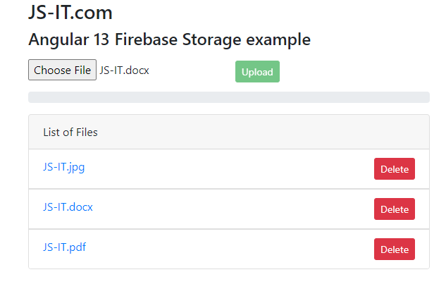

# Angular 13 File Upload to Firebase Storage example

I will show you how to make Angular 13 Firebase Storage: File Upload/Display/Delete Application using `@angular/fire` & `AngularFireStorage`. Files' info will be stored in Firebase Realtime Database.

More Practice:
> [Angular CRUD Application example with Web API](https://github.com/JS-IT/angular-13-crud-example/)

> [Angular 12 Firebase CRUD with Realtime DataBase | AngularFireDatabase](https://github.com/JS-IT/angular-12-firebase-crud/)

> [Angular 13 Firebase CRUD with Realtime DataBase | AngularFireDatabase](https://github.com/JS-IT/angular-13-firebase-crud/)

> [Angular 12 Firestore CRUD example with AngularFireStore](https://github.com/JS-IT/angular-12-firestore-crud/)

> [Angular 13 Firestore CRUD example with AngularFireStore](https://github.com/JS-IT/angular-13-firestore-crud/)

> [Angular 13 Firebase Storage: File Upload/Display/Delete example](https://github.com/JS-IT/angular-13-file-upload-firebase-storage/)

Fullstack with Node Express:
> [Angular + Node Express + MySQL example](https://github.com/JS-IT/nodejs-express-mysql/)

> [Angular + Node Express + PostgreSQL example](https://github.com/JS-IT/node-express-sequelize-postgresql/)

> [Angular + Node Express + MongoDB example](https://github.com/JS-IT/node-express-mongodb/)

Fullstack with Django:

> [Angular + Django Rest Framework](https://github.com/JS-IT/django-crud-rest-framework/)

## Development server

Run `ng serve` for a dev server. Navigate to `http://localhost:4200/`. The app will automatically reload if you change any of the source files.

## Code scaffolding

Run `ng generate component component-name` to generate a new component. You can also use `ng generate directive|pipe|service|class|guard|interface|enum|module`.

## Build

Run `ng build` to build the project. The build artifacts will be stored in the `dist/` directory.

## Running unit tests

Run `ng test` to execute the unit tests via [Karma](https://karma-runner.github.io).

## Running end-to-end tests

Run `ng e2e` to execute the end-to-end tests via a platform of your choice. To use this command, you need to first add a package that implements end-to-end testing capabilities.

## Further help

To get more help on the Angular CLI use `ng help` or go check out the [Angular CLI Overview and Command Reference](https://angular.io/cli) page.
